# Generacion-de-Tile-maps

## 1 Obtener assets que incorpores a tu proyecto para la generación del mapa: planos e isométricos.

-> Assets utilizados en la práctica:
- https://assetstore.unity.com/packages/2d/environments/free-pixel-art-kit-211149
- https://assetstore.unity.com/packages/2d/environments/isometric-medieval-pack-209879

-> Para la animación del personaje y el enemigo:
- https://assetstore.unity.com/packages/2d/characters/simple-2d-platformer-assets-pack-188518

## 2 Generar al menos 2 paletas para crear un mapa rectangular.

-> Una paleta para el terreno del juego.

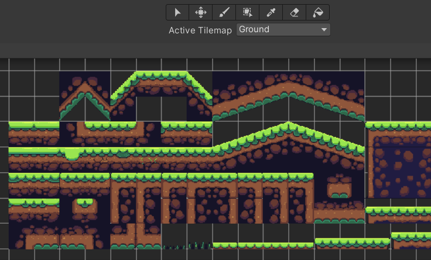

-> Otra para el fondo del nivel ( el cielo )

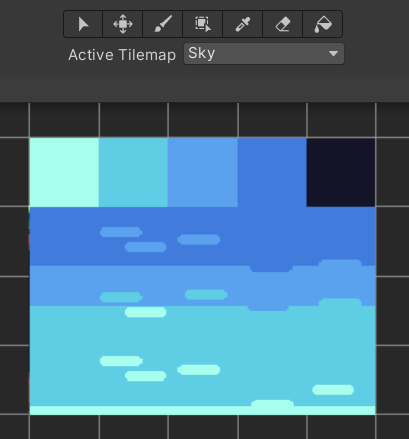

-> Mapa Rectángular generado:

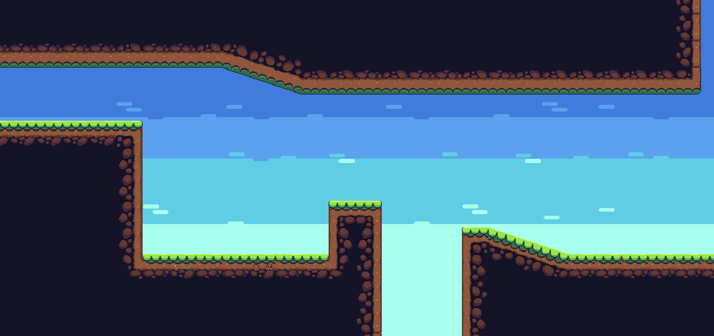

## 3 Crear un mapa isométrico.

-> Mapa Isométrico generado:

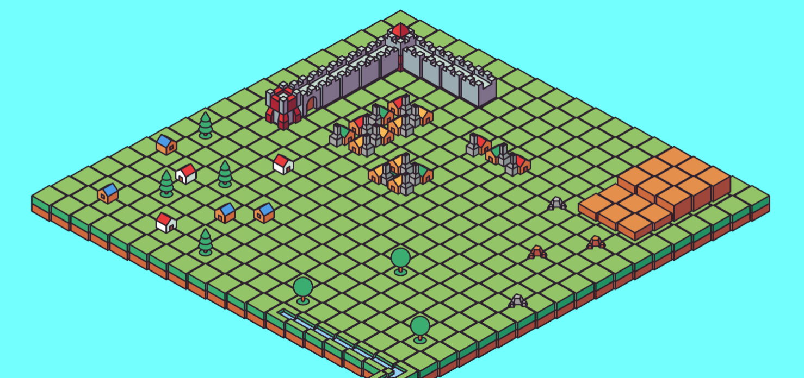

## 4 En el mapa convencional, incluir obstáculos y paredes.

-> El terreno del mapa incluye un "Tilemap Collider 2D" y un "composite Collider 2D" para generar colisiones en todas las zonas con terreno.

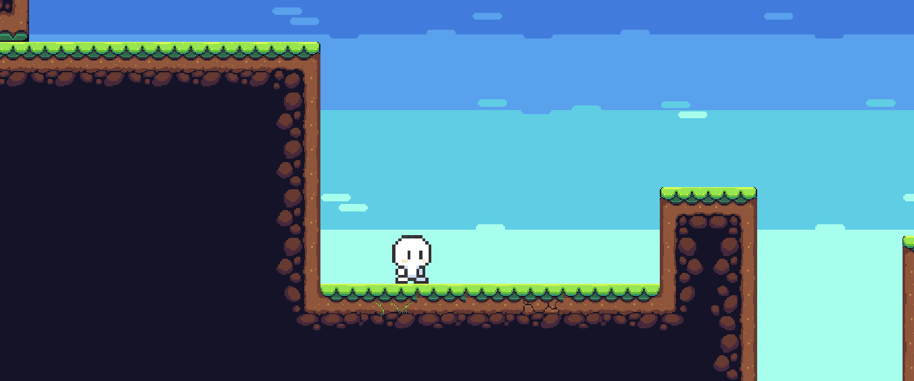

## 5 En el mapa isométrico generar zonas elevadas y obstáculos.

-> En la zona de color marrón se aprecia una zona elevada, ademas de los castillos y las casas.

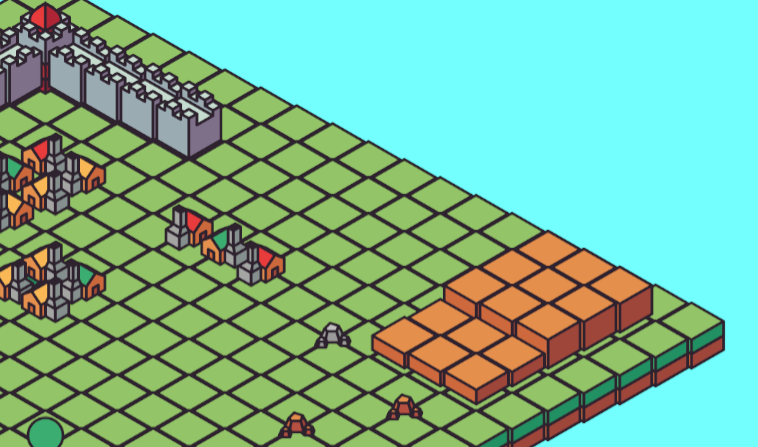

## 6 Seleccionar sprites para usar como decoración y sprites animados para usar como personaje y como enemigos e incorporarlos al juego.

-> Decoración añadida (Árboles, Rocas, Señales), personajes y enemigos con animación añadida usando el Animator:

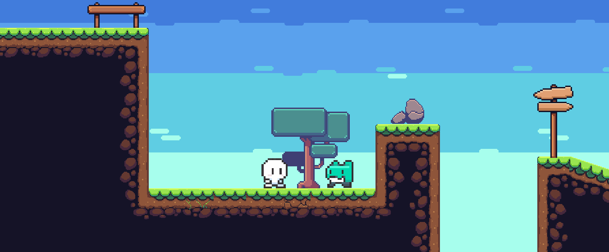

## 7 Controlar mediante scripts al menos dos transiciones de animación en el personaje y una de un enemigo.

-> Los enemigos tienen solo la animación "idle" y el personaje tiene una animación "idle" y otra mientras camina.

## 8 Incorpora elementos físicos en tu escena que respondan a las siguientes restricciones:

### A) Objeto estático que ejerce de barrera infranqueable:

-> He añadido un árbol con un Box Collider 2D a modo de barrera infranqueable

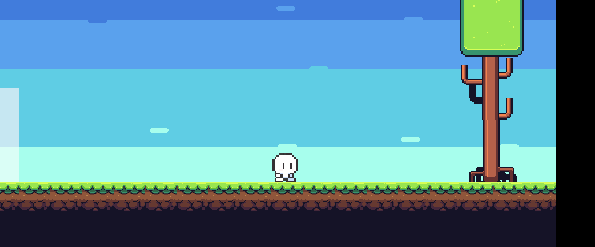

### B) Zona en la que los objetos que caen en ella son impulsados hacia adelante

-> Añadi una zona blanca con un collider y es "isTrigger" de modo que cuando un objeto entra se activa el evento OnTriggerStay2D() empuja con un AddForce al objeto.

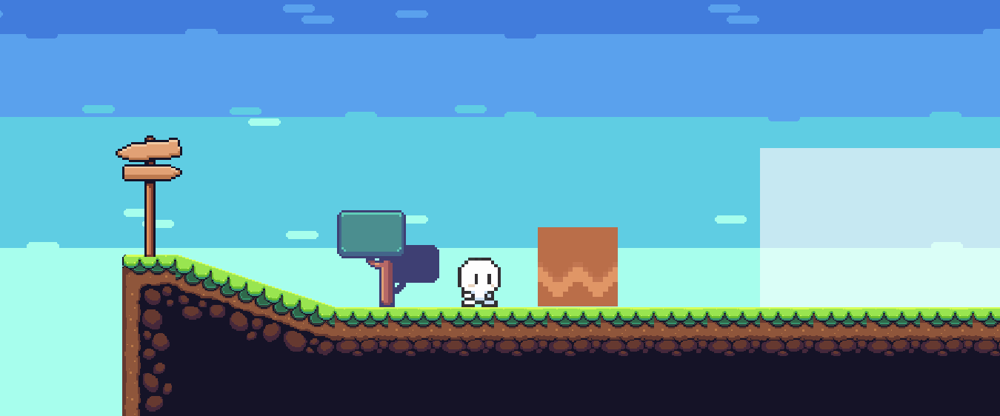

### C) Objeto que es arrastrado por otro a una distancia fija

-> Una caja con un Box Collider 2D y un RigidBody 2D que podremos empujar con nuestro personaje

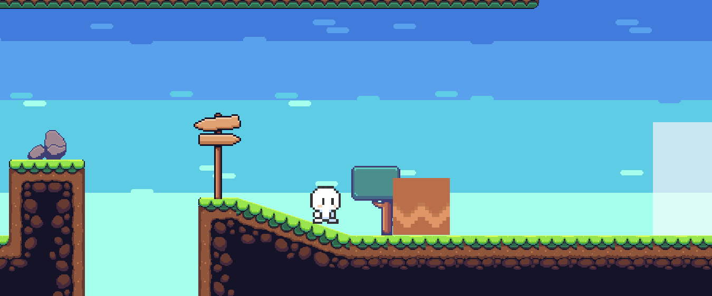

### D) Objeto que al colisionar con otros sigue un comportamiento totalmente físico.

-> La caja que pudimos empujar antes, se puede ver que reaccióna con el resto de elementos del juego.

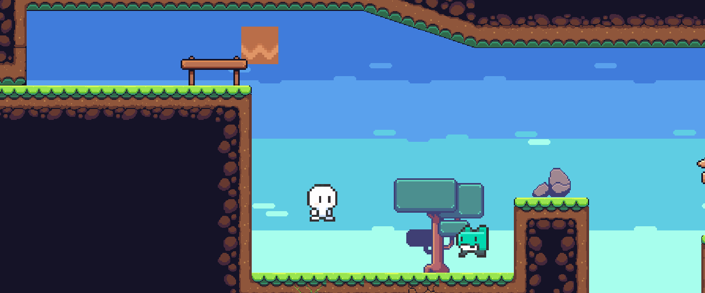

### E) ncluye dos capas que asignes a diferentes tipos de objetos y que permita evitar colisiones entre ellos.

-> 

